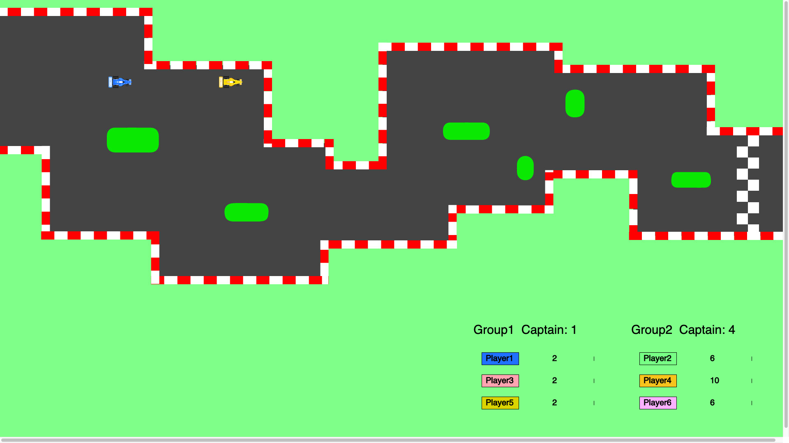
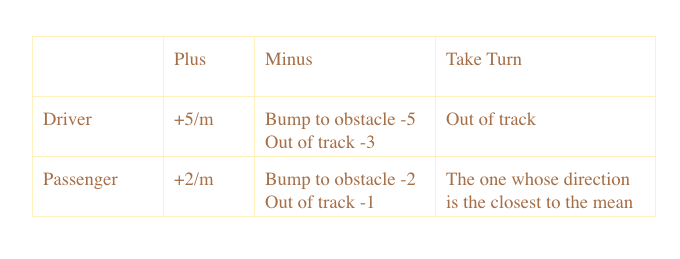

# Democratic Drive
A collaborative 2d car racing game written in NodeJS

    

## Mechanism
This is a car racing game with democratic metaphor.
2 teams compete with each other; people in the same team also compete for contribution.
There are 2 characters: driver and passenger.
People decide the direction together, but the driver has 60% of weight to influence the direction, while all other passengers take 40%.
The player with the highest score wins.

## Scoring System

    

## Implementation

### server.js
The server side code. Collect and manage data from client inputs and send data to client output to show the result on the screen.

### public/input/sketch.js
The code for players.
It requires players to use a smart phone or any device with accelerometer.
The direction of the racing car is determined by the tiltness value of all player's device in the same team.

### public/output/sketch.js
The code for the racing game UI and gamplay.